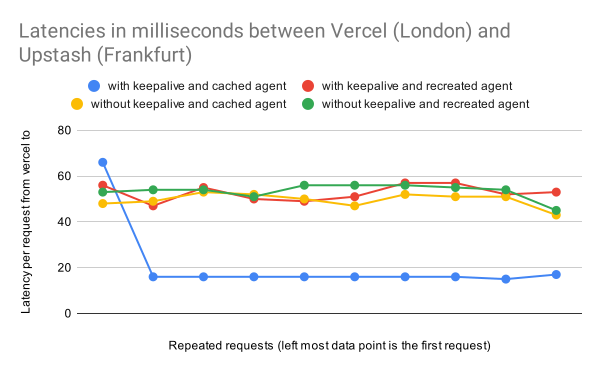

This is a [Next.js](https://nextjs.org/) application to test the latency implication of using `keepalive` between serverless functions and [Upstash Redis](https://upstash.com/) via `REST`.

## Getting Started

Requires `node 18` or a `fetch` polyfill for the testing script.

1. Create redis database [here](https://console.upstash.com/)

2. Add your url and token to `.env`

3. Then run your development server:

```bash
npm install
npm run dev
```

4. Run tests
```bash
node ./test.js http://localhost:3000
```

## Testing on real hardware

1. Create redis database [here](https://console.upstash.com/)

2. Add url and token to vercel `https://vercel.com/<ORG>/<PROJECT>/settings/environment-variables`

3. Deploy this nextjs application

4. Run tests
```bash
node ./test.js <DEPLOYMENT_URL_WITH_PROTOCOL_PREFIX_BUT_WITHOUT_TRAILING_SLASH>
```


## What is going on?

This application covers 4 different scenarios:

- An agent is used to keep the connection alive: yes | no
- The agent is kept in memory outside of the api handler and is available during hot starts: yes | no


## Results

